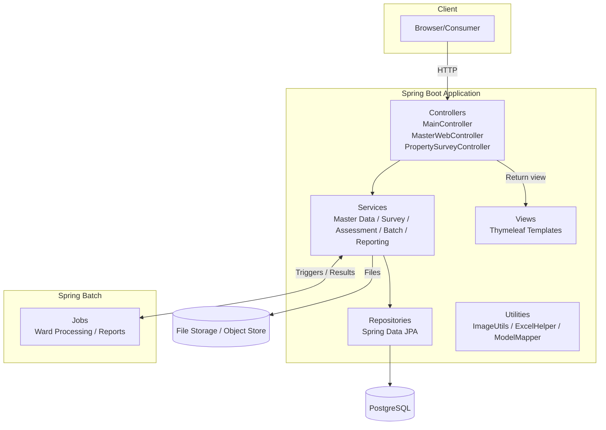
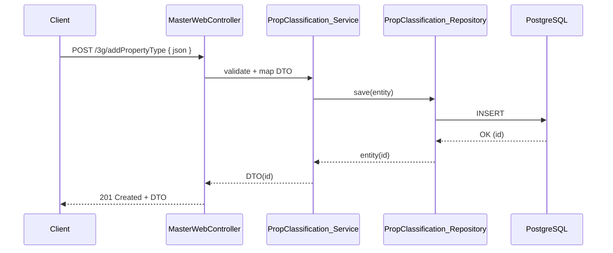

# Diagrams

This document provides Mermaid diagrams for system architecture, a typical API flow, and a conceptual entity relationship model inferred from the codebase.

## System Architecture


## API Flow (Example: Create Property Type)


## Entity Relationships (Conceptual)
```mermaid
erDiagram
    PROPERTY_DETAILS ||--o{ UNIT_DETAILS : contains
    PROPERTY_DETAILS ||--o{ UNIT_BUILTUP_DETAILS : contains
    PROPERTY_DETAILS ||--o{ UNIT_OLD_DETAILS : contains

    PROPERTY_DETAILS }o--|| WARD : in
    PROPERTY_DETAILS }o--|| ZONE : in
    PROPERTY_DETAILS }o--|| OLD_WARD : historical

    PROPERTY_DETAILS }o--|| OWNER_TYPE : owner_type
    PROPERTY_DETAILS }o--|| OWNER_CATEGORY : owner_category

    PROPERTY_DETAILS }o--|| SEWERAGE_TYPE : sewerage
    PROPERTY_DETAILS }o--|| WATER_CONNECTION : water

    PROPERTY_DETAILS }o--|| BUILDING_TYPE : building
    PROPERTY_DETAILS }o--|| BUILDING_SUBTYPE : sub_building

    PROPERTY_DETAILS }o--|| CLASSIFICATION : classification
    PROPERTY_DETAILS }o--|| SUBCLASSIFICATION : sub_classification

    PROPERTY_DETAILS }o--|| USAGE_TYPE : usage
    PROPERTY_DETAILS }o--|| SUB_USAGE_TYPE : sub_usage

    PROPERTY_DETAILS }o--|| OCCUPANCY : occupancy
    PROPERTY_DETAILS }o--|| CONSTRUCTION_CLASS : construction
    PROPERTY_DETAILS }o--|| AGE_FACTOR : age

    PROPERTY_DETAILS }o--|| ROOM_TYPE : room_type

    ASSESSMENT_RESULT }o--|| PROPERTY_DETAILS : for_property
    PROPERTY_RATES }o--o{ CLASSIFICATION : by_class
    CONSOLIDATED_TAX }o--o{ RV_TYPE : applies_to

    PROPERTY_DETAILS {
        bigint id PK
        varchar pd_newpropertyno_vc UNIQUE
        int pd_ward_i
        varchar pd_surypropno_vc
        varchar pd_suryprop1_vc
        int pd_suryprop2_vc
        varchar pd_finalpropno_vc
        varchar pd_noticeno_vc
        timestamp created_at
        timestamp updated_at
    }
```

Notes:
- The ERD is conceptual and based on entities and DTOs found in the repository (exact columns/types may vary).
- Flyway functions V2/V3 assign `pd_finalpropno_vc` and `pd_noticeno_vc` for `PROPERTY_DETAILS` per ward.

