# Entity–Relationship Overview

This document summarizes the core entities in the application, how they relate, and how data flows from master setup → property registration → assessment (realtime/batch) → reporting. Use it as a source for ERD diagrams.

## Core Flow (High Level)
- Masters created first (zones, wards, property/usage/building catalogs, occupancy, construction class, assessment dates, age factor, consolidated taxes, rates, cess).
- Property registration (new/old) references those masters by id/code.
- Units and their built‑up rows (rooms/areas) attach to a property.
- Realtime assessment computes per‑unit/property values, then consolidated taxes for a property.
- Batch assessment runs the same computations at scale and stores results for reporting (calculation sheets, assessment results PDFs). Spring Batch tables store job metadata.

## Core Entities
- `property_details`
  - Uniquely identified by `pd_newpropertyno_vc` (and internal id).
  - References master tables for zone, ward, owner type/category, property type/subtype, usage type/subtype, building type/subtype, occupancy, construction class, assessment dates.
  - Stores owner/occupier information, address, survey/final property numbers, connection and infrastructure details, and aggregated areas (plot/built‑up/carpet/assessable).

- `unit_details`
  - Child of `property_details` (1 property → N units).
  - Holds per‑unit metadata: unit no, floor no, occupancy status, usage type/subtype, construction/age factor, per‑unit areas, remarks, contacts, optional tenant info.

- `unit_builtup_details` (aka built‑up rows)
  - Child of `unit_details` (1 unit → N room/area rows).
  - Holds room/use, inner/outer measure type, deduction %, dimensions, area before deduction, carpet/assessable areas, exemptions, legal/illegal areas.

## Assessment Entities (computed)
- `property_rvalues`
  - Per property/unit computed values: yearly rent, ALV, depreciation (dep%) and amounts, lenting values, rate per sqm, considered values.
  - FK by property no + unit no.

- `proposed_rvalues`
  - Per property aggregated ratable values: totals and splits (residential vs non‑residential), per‑category splits used in reports.
  - FK by property no.

- `property_taxdetails`
  - Per property consolidated taxes as columns (e.g., property tax, edu cess residential/commercial/total, user charges, EGC, fire, light, tree, clean tax, final total tax).
  - FK by property no.

- `assessmentdate_master`
  - Current/last/first assessment dates used in computations and reports.

## After‑Assessment / Audit
- `property_deletion_log` (audit of deletions when removing properties, with image snapshots).
- Special notice / objection modules:
  - `special_notice` (prepared/served notices).
  - `register_objection` (objections filing and processing).

## Master Catalogs (Lookup)
- Geography: `zone_master`, `ward_master`, `oldward_master`.
- Classification: `prop_classification_master`, `prop_subclassification_master`.
- Usage: `prop_usage_type_master`, `prop_sub_usage_type_master`.
- Building: `building_type_master`, `building_subtype_master`.
- Property details: `owner_type_master`, `owner_category_master`, `build_status_master`, `water_connection_master`, `sewerage_master`, `room_type_master`, `remarks_master`.
- Assessment aides: `construction_class_master`, `age_factor_master`, `assessmentdate_master`.
- Tax catalogs: `consolidated_taxes_master` (with `taxType` and `taxKeyL`), `property_rates_master`, `edu_cess_emp_cess_master`, `rv_types`/`rv_type_category`, `tax_depreciation_master`.

## Spring Batch (Process Metadata)
- Standard Spring Batch tables: `BATCH_JOB_INSTANCE`, `BATCH_JOB_EXECUTION`, `BATCH_JOB_EXECUTION_PARAMS`, `BATCH_STEP_EXECUTION`, `BATCH_STEP_EXECUTION_CONTEXT`, `BATCH_JOB_EXECUTION_CONTEXT`.
- Store batch run lineage and outcomes for ward‑level assessments and report generation.

## Relationships (Cardinalities)
- `property_details` 1 — N `unit_details`.
- `unit_details` 1 — N `unit_builtup_details`.
- `property_details` N — 1 `zone_master`, `ward_master`, `oldward_master`.
- `property_details` N — 1 `owner_type_master`, `owner_category_master`.
- `property_details` N — 1 `prop_classification_master` / `prop_subclassification_master`.
- `property_details` N — 1 `prop_usage_type_master` / `prop_sub_usage_type_master`.
- `property_details` N — 1 `building_type_master` / `building_subtype_master`.
- `property_details` N — 1 `construction_class_master`, `occupancy_master`.
- `property_details` 1 — N `property_rvalues` (joined by property no + unit no) and 1 — 1 `proposed_rvalues` (by property no).
- `property_details` 1 — 1 `property_taxdetails`.

## Process Flow (Detail)
1) Master Creation
- Admin creates catalogs via MasterWebController and MasterWebServices (Zones/Wards, Owner Type/Category, Property/Usage/Building, Room/Remarks, Construction Class/Occupancy, Assessment Dates/Age Factor, Consolidated Taxes/Property Rates/Cess/RV Types/Depreciation).

2) Property Registration
- New: PropertySurveyController accepts multipart (JSON + images). PropertyManagement_Service orchestrates:
  - Insert `property_details` → assign pd_newpropertyno_vc (UniqueIdGenerator) → create `unit_details` → create `unit_builtup_details`.
- Old: `property_old_details` maintained and can be linked to new records by reference/pinning; both new and old can be updated/deleted.

3) Assessment Configuration
- Council rates and consolidated taxes entered via PropertyRates_MasterService, ConsolidatedTaxes_MasterService, EduCessAndEmpCess_MasterService, RVTypes_MasterService, TaxDepreciation_MasterService.

4) Realtime Assessment
- TaxAssessment_MasterService (Realtime) computes:
  - Per‑unit `property_rvalues` (ALV, yearly rent, rates, depreciation, amounts)
  - Per‑property `proposed_rvalues` and `property_taxdetails` (consolidated taxes)
- CalculationSheet/Assessment PDF generators can render per property.

5) Batch Assessment
- Spring Batch job reads properties, computes same outputs as realtime, writes per‑property results.
- Batch report generators aggregate and render calculation sheets for the ward.

## Suggested Keys & Indexes
- `property_details(pd_newpropertyno_vc)` UNIQUE.
- Composite index for search: `(pd_ward_i, pd_finalpropno_vc)`, `(pd_surypropno_vc)`.
- FKs to masters on id/code columns; index each FK column used in filters.
- `property_rvalues(prv_propertyno_vc, prv_unitno_vc)` index.
- `property_taxdetails(pt_newpropertyno_vc)` index.

## Mermaid ERD (Conceptual)

```mermaid
erDiagram
  PROPERTY_DETAILS ||--o{ UNIT_DETAILS : has
  UNIT_DETAILS ||--o{ UNIT_BUILTUP_DETAILS : has

  PROPERTY_DETAILS }o--|| ZONE : in
  PROPERTY_DETAILS }o--|| WARD : in
  PROPERTY_DETAILS }o--|| OLD_WARD : historical

  PROPERTY_DETAILS }o--|| OWNER_TYPE : has
  PROPERTY_DETAILS }o--|| OWNER_CATEGORY : has

  PROPERTY_DETAILS }o--|| PROP_CLASSIFICATION : has
  PROPERTY_DETAILS }o--|| PROP_SUBCLASSIFICATION : has
  PROPERTY_DETAILS }o--|| USAGE_TYPE : has
  PROPERTY_DETAILS }o--|| SUB_USAGE_TYPE : has

  PROPERTY_DETAILS }o--|| BUILDING_TYPE : has
  PROPERTY_DETAILS }o--|| BUILDING_SUBTYPE : has

  PROPERTY_DETAILS }o--|| OCCUPANCY : has
  PROPERTY_DETAILS }o--|| CONSTRUCTION_CLASS : has

  PROPERTY_DETAILS ||--o{ PROPERTY_RVALUES : computed
  PROPERTY_DETAILS ||--|| PROPOSED_RVALUES : computed
  PROPERTY_DETAILS ||--|| PROPERTY_TAXDETAILS : taxes

  CONSOLIDATED_TAXES_MASTER }o--o{ PROPERTY_TAXDETAILS : defines
```

Notes
- Table/column names in diagrams are conceptual; align them with actual SQL mapping.
- Assessment outputs (`property_rvalues`, `proposed_rvalues`, `property_taxdetails`) are generated either by realtime service or batch job.
- Batch job metadata is in standard Spring Batch tables and left out of the simplified ERD.

